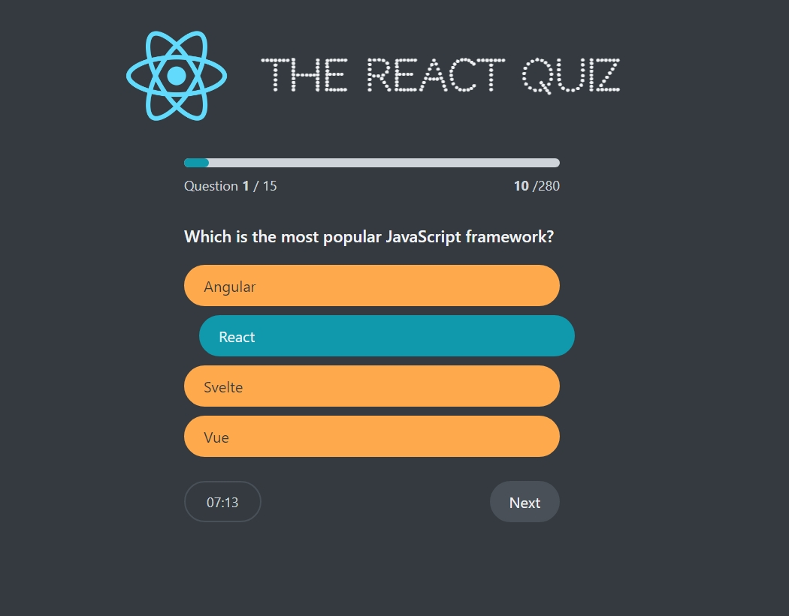

## React Quiz

This is an experimental app to build a simple Quiz app following best practices to build React applications.
The application makes use of useReducers in place of useState hooks.
The reducers help control the change of states for a component at a single place thereby making the code much cleaner and easier to understand.

Screenshot of how the question screen looks:

